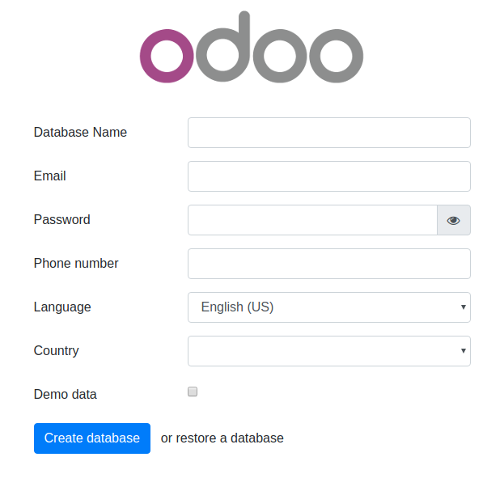

# Quick install

Installing Odoo 15 with one command.

(Supports multiple Odoo instances on one server)

Install [docker](https://docs.docker.com/get-docker/) and [docker-compose](https://docs.docker.com/compose/install/) yourself, then run:

``` bash
curl -s https://raw.githubusercontent.com/odoodvlpr/odoo-15-docker-composer/main/run.sh | sudo bash -s odoo-15 10015 20015
```

to set up first Odoo instance @ `localhost:10013` (default master password: `ics.info`)

and

``` bash
curl -s https://raw.githubusercontent.com/odoodvlpr/odoo-15-docker-composer/main/run.sh | sudo bash -s odoo-15-2 11015 21015
```

to set up another Odoo instance @ `localhost:11015` (default master password: `ics.info`)

Some arguments:
* First argument (**odoo-15**): Odoo deploy folder
* Second argument (**10015**): Odoo port
* Third argument (**20015**): live chat port

If `curl` is not found, install it:

``` bash
$ sudo apt-get install curl
# or
$ sudo yum install curl
```

# Usage

Start the container:
``` sh
docker-compose up
```

* Then open `localhost:10015` to access Odoo 13.0. If you want to start the server with a different port, change **10013** to another value in **docker-compose.yml**:

```
ports:
 - "10013:8069"
```

Run Odoo container in detached mode (be able to close terminal without stopping Odoo):

```
docker-compose up -d
```

**If you get the permission issue**, change the folder permission to make sure that the container is able to access the directory:

``` sh
$ git clone https://github.com/odoodvlpr/odoo-15-docker-composer
$ sudo chmod -R 777 addons
$ sudo chmod -R 777 etc
$ mkdir -p postgresql
$ sudo chmod -R 777 postgresql
```

Increase maximum number of files watching from 8192 (default) to **524288**. In order to avoid error when we run multiple Odoo instances. This is an *optional step*. These commands are for Ubuntu user:

```
$ if grep -qF "fs.inotify.max_user_watches" /etc/sysctl.conf; then echo $(grep -F "fs.inotify.max_user_watches" /etc/sysctl.conf); else echo "fs.inotify.max_user_watches = 524288" | sudo tee -a /etc/sysctl.conf; fi
$ sudo sysctl -p    # apply new config immediately
```

# Custom addons

The **addons/** folder contains custom addons. Just put your custom addons if you have any.

# Odoo configuration & log

* To change Odoo configuration, edit file: **etc/odoo.conf**.
* Log file: **etc/odoo-server.log**
* Default database password (**admin_passwd**) is `ics.info`, please change it @ [etc/odoo.conf#L60](/etc/odoo.conf#L60)

# Odoo container management

**Run Odoo**:

``` bash
docker-compose up -d
```

**Restart Odoo**:

``` bash
docker-compose restart
```

**Stop Odoo**:

``` bash
docker-compose down
```

# Live chat

In [docker-compose.yml#L21](docker-compose.yml#L21), we exposed port **20013** for live-chat on host.

Configuring **nginx** to activate live chat feature (in production):

``` conf
#...
server {
    #...
    location /longpolling/ {
        proxy_pass http://0.0.0.0:20015/longpolling/;
    }
    #...
}
#...
```

# docker-compose.yml

* odoo:15.0
* postgres:13

# Odoo 15 screenshots




